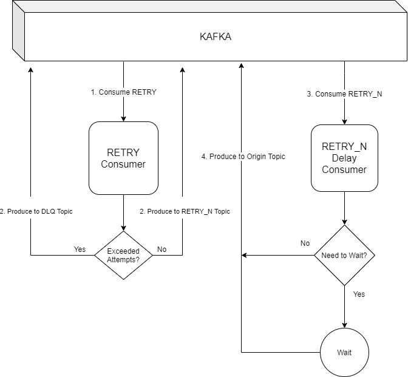

# Kafka - Retry Mechanism and Delay Queue

## Introduction

This project aims to isolate the implementation of Retry Mechanism and Delay Queue.
When we think of a fault-tolerant system one of the things we should keep in mind is if there is an error, how can I minimize that impact?.
A widely used standard is to reprocess until it finds success or the number of attempts exceeds the maximum limit.
In this case the message is sent to a DLQ. (Dead Letter Queues).
 

## How it works?

For the kafka system, a message is basically composed of HEADERS and PAYLOAD.
The HEADER is a basic KEY-VALUE structure containing control properties used by kakfa such as TOPIC, GROUP_ID and etc.
In it we can add custom keys and based on them the retry strategy is implemented.

## How to use

Let's imagine a scenario that we need to integrate with the federal revenue system.
These messages will be processed based on a particular topic, for example "FederalRevenue".

The basic idea is that when the consumer performs the integration and fails for reasons of unavailability he produces a
new message for the `retry` topic.

This new message should be a copy, and we must inform some custom headers.

| Header       | Required  | Default          | Description                                                            |  
|--------------|-----------|------------------|------------------------------------------------------------------------|
| retry_origin    | true      |                  | Topic from which the retry originated. (Our example: FederalRevenue)   |
| retry_dlq_topic | false     | ${retry_origin}.dlq | Topic used in case the message exceeds the maximum number of attempts. |

After that, the Retry Mechanism will perform the retry sending back de message for the origin topic until gets success 
or exceeds the attempts.

Each attempt will be executed respecting a delay that will be gradual so as not to impact performance.
Currently there will be five attempts with delays of 1m, 5m, 10m, 30m and 1h.

Enjoy.